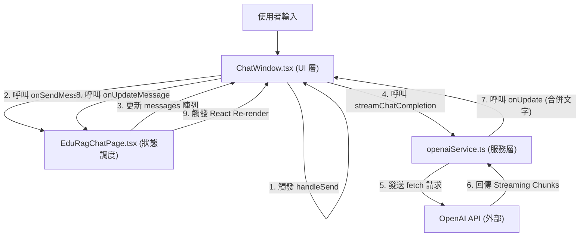

# Edu-RAG 前端開發與架構交接文檔

本文件旨在協助開發者快速理解「新北教育 RAG 助手」前端專案的開發狀況、設計理念、技術架構與資料串接流程。

## 1. 專案基礎設定
- **框架**: React + Vite (TypeScript)
- **環境變數**: 
  - 專案根目錄下設有 `.env` 檔案，包含 `VITE_OPENAI_API_KEY` 用於前端測試。
  - **重要**: 生產環境務必將 API 請求遷移至後端 Proxy，以確保密鑰安全。

## 2. 目錄結構與關鍵檔案
- `src/edu-rag/pages/`: 
  - `EduRagChatPage.tsx`: 聊天主頁的核心邏輯，管理對話列表與訊息狀態。
- `src/edu-rag/components/`:
  - `ChatWindow.tsx`: 核心聊天元件，處理訊息呈現、IME 優化及 API 串接邏輯。
  - `ThreadList.tsx`: 左側側邊欄，負責對話切換與管理。
- `src/edu-rag/services/`:
  - `openaiService.ts`: 封裝 OpenAI 串流請求與解析邏輯。

## 3. 程式碼串接架構 (Data Flow)

## 4. 核心技術亮點
### A. 思維鏈 (Chain of Thought) 解析
- 在 `ChatWindow.tsx` 中透過 `parseContent` 函數解析 `<thought>` 標籤。
- 畫面上會優先渲染「思考歷程」區塊，隨後才是最終回答。

### B. 串流處理 (Streaming)
- 使用 `ReadableStream` 搭配 `TextDecoder` 進行非同步迭代。
- 具備 Partial JSON 解析容錯機制，確保串流過程中的文字能即時顯示。

### C. 使用者體驗優化 (UX)
- **IME 優化**: 在 `textarea` 處理 `isComposing` 狀態，避免中文選字時 Enterprise 鍵提早送出訊息。
- **視覺風格**: 採用 Google 提供的設計語彙，結合 `Glassmorphism` 毛玻璃特效與 `Sky-500` 品牌識別色。

## 5. 未來開發建議 (Roadmap)
- **資料庫串接**: 目前為純前端 State 管理，需實作後端 API 以達成對話紀錄持久化。
- **文件檢索整合**: 需銜接 RAG 後端的檢索 API，並將文件來源標註整合至 `ChatWindow` 中。
- **權限與登入**: 需整合教育局單一簽入 (SSO) 系統。
